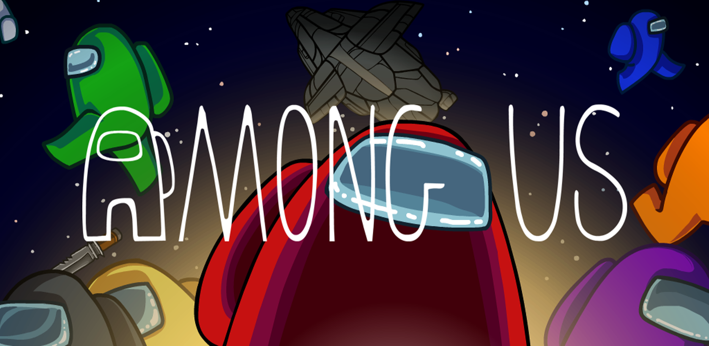
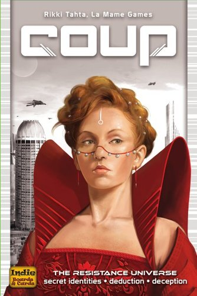
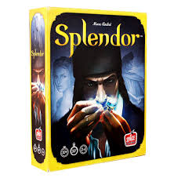
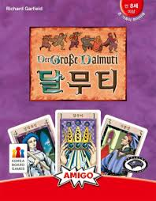

<body><ol><li>디지털게임</li>
<li><a href="index.html">아날로그게임</a></li>
<li><a href="1.html">통합게임</a></li> </ol>
<h1><a href="2.html">보드게임</a></h1>
<strong>1.어몽어스 (온라인게임)</strong> 
 
<strong>2.쿠(온라인 보드게임)</strong> 
 
<strong>3.스플렌더 (만민의 보드게임)</strong> 
  

<strong>4.달무트 (우정파괴 게임)</strong> 

</ 본문 > </ html>
